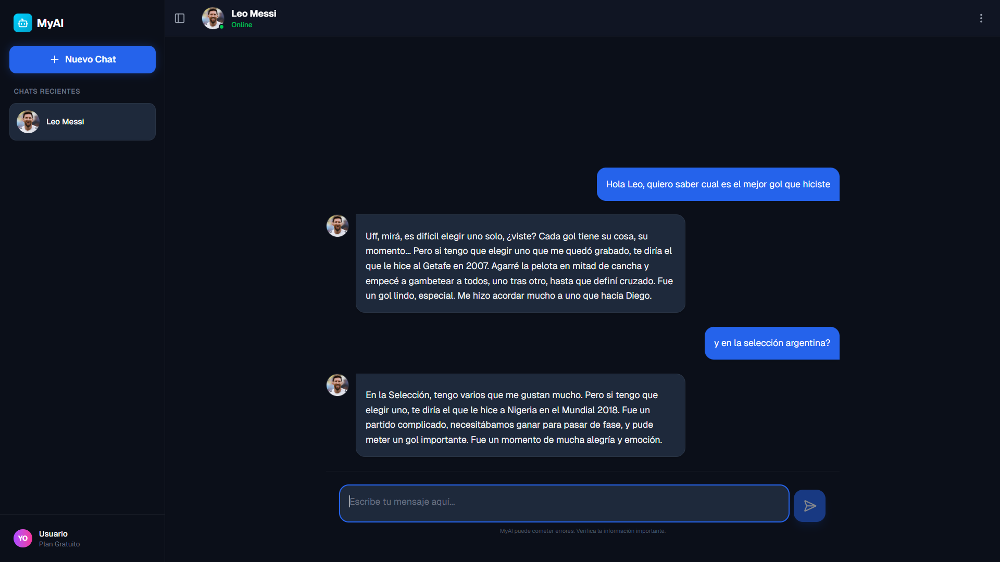

# MyAI — Personajes impulsados por IA

<div align="center">
	
</div>

Una interfaz de chat moderna que permite crear personajes conversacionales personalizados y chatear con ellos usando APIs de generación de texto.

Este proyecto se desarrolló para demostrar habilidades en la integración y uso de APIs de IA (transmisión de respuestas, prompts de sistema/personaje, UI con Next.js y React). Se construyó en un fin de 2 días trabajando part-time — la funcionalidad principal está implementada y funcionando como se esperaba; sin embargo, aún quedan oportunidades de mejora (ver la sección "Mejoras y próximos pasos").

---

## Descripción

MyAI es una demo de chat basada en Next.js y TailwindCSS que pone el foco en la personalización de “personajes” por medio de prompts de sistema y el manejo de conversaciones en streaming. Incluye:

- Creación/edición/eliminación de personajes con avatar y prompt personalizado.
- Chat en tiempo real (streaming) usando el SDK de Google Generative AI / `ai`.
- Persistencia local (localStorage) para personajes e historial de chat.
- Interfaz ligera y responsiva con componentes reutilizables.

## Características principales

- Personalización de personajes: nombre, avatar y "system prompt".
- Conversación en streaming para respuestas más naturales y fluidas.
- Guardado de historial por personaje en `localStorage`.
- Frontend con Next.js 16 y React 19.
- Uso del SDK: `@ai-sdk/google`, `@ai-sdk/react` y `ai`.

## Tech stack 🔧

- Next.js 16
- React 19
- TypeScript
- TailwindCSS v4
- `@ai-sdk/google`, `ai`, `@ai-sdk/react`
- `lucide-react` para iconografía

## Requisitos previos

- Node.js 18+ (recomendado)
- NPM (o yarn/pnpm)
- Una API key válida para Google Generative AI (o la integración que desee usar)

## Variables de entorno

La API consta de una ruta que ejecuta la comunicación con el proveedor de IA en el servidor (Edge runtime). Para que la aplicación funcione correctamente configure la siguiente variable de entorno:

```bash
GOOGLE_GENERATIVE_AI_API_KEY=su_api_key
```

Guárdela en un archivo `.env.local` en el root del proyecto o configure la variable en su entorno de despliegue.

> Importante: Nunca comitees las API keys en el repositorio.

## Instalación y ejecución (desarrollo)

1. Instale dependencias:

```bash
npm install
# o: pnpm install
```

2. Ejecute la app en modo desarrollo:

```bash
npm run dev
```

3. Abrir la app:

```
http://localhost:3000
```

## Ejecución en producción

1. Build:

```bash
npm run build
```

2. Start:

```bash
npm run start
```

## Estructura del proyecto (resumen)

- `app/` — Rutas y componentes principales (Landing, Chat, Modal para crear personajes, etc.)
- `app/api/chat/route.ts` — Endpoint server-side (Edge) que consume la API de Google Generative AI para streaming de respuestas.
- `lib/storage.ts` — Utilidades para persistir personajes e historial en `localStorage`.
- `public/hero-screenshot.png` — Captura de pantalla usada en el Hero

## Cómo usar

1. Abre la app.
2. Pulsa "Empezar" o "Comenzar" y crea un personaje (nombre, prompt, avatar opcional).
3. Selecciona el personaje y empieza a chatear. Las respuestas aparecen en streaming.
4. El historial se guarda localmente por personaje.

## Notas sobre seguridad y despliegue

- Mantén la clave `GOOGLE_GENERATIVE_AI_API_KEY` en el servidor (no exponer en el cliente).
- Para despliegue en Vercel u otro proveedor, configura la variable de entorno en la plataforma.

## Limitaciones y mejoras ✅⚠️

El proyecto se hizo en 2 días trabajando part-time; por tanto, aunque las funcionalidades básicas están implementadas, hay mejoras importantes que se pueden abordar:

- Almacenamiento en servidor o base de datos para sincronización entre dispositivos.
- Autenticación (usuarios) y control de acceso a historiales.
- Pruebas unitarias / E2E para garantizar estabilidad.
- Mejor manejo de errores y mensajes amigables en la UI.
- Integración con otros modelos o proveedores y configuración dinámica.
- Manejo avanzado de tokens y limitaciones de uso del proveedor.
- Internacionalización y mejoras de accesibilidad (ARIA).

## Contribuciones

Este es un proyecto demo — siéntete libre de abrir issues o PRs para proponer mejoras o correcciones. Si quieres clonar y trabajar en el repo, sigue la sección "Instalación".

## Autor

- Proyecto desarrollado por @DaniielDz — creado como demostración de integración con APIs de IA y experiencia en UI/UX.

---

**Estado del desarrollo:** Completado en 2 días de trabajo part-time. Funcionamiento principal listo y verificado; se dejaron notas de mejoras para iteraciones futuras.
